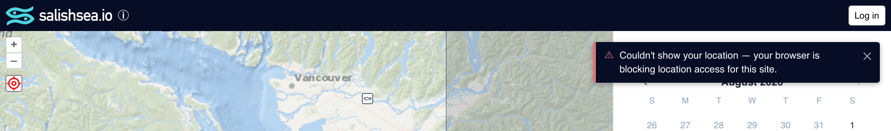

# 031 — Failures reach the user through one toast, and Sentry through the same call

**Status:** accepted · **Decided:** 2026-08-28 · bd `salish-i7v`

## Context

The app had no way of telling anyone that something had failed. Three call sites had each
made their own arrangement, and all three amounted to silence:

- `receiveIdToken` reported sign-in failures to Sentry and rethrew — visible to us, invisible
  to the person clicking a Log in button that appeared to do nothing ([030](030-google-signin-nonce.md)).
- `obs-summary`'s delete handler logged to the console behind a standing
  `TODO: surface to user via a toast/state property`.
- `fetchOccurrences` let a failed query reject into a `console.error`, or in several callers
  into nothing at all. An empty sighting list is indistinguishable from a quiet day on the
  water, so a failed load silently misrepresents the data.

The precipitating case is worth stating plainly, because it is the argument for coupling the
two halves. Decision 030 was a bug that reached *neither* audience: Supabase returns auth
failures in the result rather than throwing, the Supabase Sentry integration only wraps
PostgREST, and the `{error}` was discarded. Nothing was reported and nothing was shown, for
weeks, until someone mentioned in passing that they could not sign in.

## Decision

**One toast, owned by `<salish-sea>`.** [`error-toast.ts`](../../src/error-toast.ts) hangs from
the top-right of the content area, directly under the Log in button and over the top of the
sightings panel — the two places a person is when an action of theirs fails. It is positioned
against `main` rather than the page, so it clears the header without anyone hardcoding the
header's height, and it stays out of the layout, so nothing reflows when a failure appears.
The newest failure replaces the current one rather than stacking: a pile of toasts over the map
is worse than the latest fact about what is broken.

It first went bottom-left, over open water, which is the calmest place to put it and the wrong
one. Feedback that far from the control that produced it is feedback nobody reads: the Log in
button is in the opposite corner, and a person who clicks it and sees nothing change has
already concluded the button is broken before their eye reaches the message.

**One call reports to both audiences.** [`reportError(source, message, {cause, persist})`](../../src/report-error.ts)
captures to Sentry *and* dispatches a `report-error` event that bubbles composed to
`<salish-sea>`. Telling the user and telling ourselves are one action because the failure that
motivated this reached neither, and two calls are two chances to do half the job. Anything in
the tree can call it; nothing in between has to relay it.

**Two lifetimes, one flag.** A failed action clears itself after 8s. A `persist` failure stays
until dismissed, for a condition that is still true after the toast would have gone — sightings
that never loaded is the case that forced the distinction.

| Token | Value | Role |
|---|---|---|
| Surface | `rgb(8, 13, 38)` | The header's navy, so a failure reads as chrome rather than map content |
| Accent | `rgb(229, 115, 115)` | Left rule and ⚠ glyph; the only colour this pattern introduces |
| Anchor | top `1rem`, right `1rem` of `main` | Under the Log in button; clear of `user-location-control` (top-left) and the feedback button (bottom-right) |

## Rejected alternatives

**A status line in the header.** No new layout, no timers, nothing floating over the map.
Rejected on width: the header already carries the lockup, the about link and the Log in button,
and on a phone there is no room left for a sentence worth reading. A message truncated to
"Couldn't s…" is worse than the console.

**A bespoke message at each call site.** What the code was already drifting toward, and what
`sighting-form`'s inline `output.error` still does for validation — correctly, because a field
error belongs beside its field. Rejected for failures of *actions*, which have no natural place
on screen and would have produced three unrelated treatments of the same idea.

**Letting `reportError` do only the user-facing half.** Tidier separation, and it would have
left the Sentry call at each site where someone can forget it. The coupling is the point.

**Stale failures stay quiet.** A failed occurrence load reports only if its date and region
still match what is on screen, the same guard `receiveOccurrences` applies to a successful one
and for the same reason — a slow request for the day you just left must not speak for the day
you are looking at. Without it, a late failure would claim a current, complete list was
incomplete.

## Follow-through — 2026-08-30 (bd `salish-rot`)

The pattern above landed at three call sites and left the rest of the app as it found it.
`salish-rot` brought the remainder onto it, and settled one thing the original decision did
not have to:

**A confirmed delete removes the row; the broadcast only reconciles.** Deleting a sighting used
to remove nothing locally — the row left the list when the `occurrences_changed` realtime
broadcast came back and re-fetched. That makes a websocket the mechanism by which a button
works, so a dropped or missed broadcast leaves a sighting on screen that the server deleted,
and nothing on screen says so. `obs-summary` now announces `sighting-deleted` once the server
has confirmed it; `<salish-sea>` drops the row and re-fetches behind it. Rejected: an
*optimistic* removal, i.e. dropping the row before the server answers. It reads faster and it
lies — the failure case then has to put a row back, which is worse than the wait.

Editing the list locally needed a third staleness guard. This record's *"stale failures stay
quiet"* pairs a response with the date and region that asked for it, and a request issued a
moment before the delete matches on both — same day, same region — so it lands afterwards and
repaints the row that was just removed. What is wrong with it is not where it was pointed but
when it left, so `fetchOccurrences` now also carries a `#listRevision` the delete bumps, and a
response from before the bump is dropped rather than drawn.

The other paths needed no new decision, only the existing one applied: geolocation failures
(both the map's locate control and the report form's "My location" button) now name which of
the three ways they failed, via [`geolocation-message.ts`](../../src/geolocation-message.ts) —
a browser refusing, a device with no fix, and a timeout are three different things for the
person holding the phone, and only one of them is worth retrying. The map's locate control
keeps its own red state and its tooltip, now carrying the same sentence rather than the
browser's raw `error.message`.

Sign-out, contributor
loading, opening a sighting for edit, and a `?o=` permalink that won't resolve all report.
Fire-and-forget re-fetches go through `refetchOccurrences`, which exists so that the callers
with no `await` to hang a failure from — property setters, event listeners, the realtime
subscription — cannot reject into nothing.

## Consequences

Sentry now hears about the delete and occurrence-load failures it never saw, so expect those
classes to appear for the first time rather than to stay quiet.

The three profile-page entry points (`individual`, `matriline`, `ecotype`) have their own root
components and do not yet listen for `report-error`; a `reportError` call from one of them
reaches Sentry but shows nothing. Nothing calls it there today.

~~Note also `salish-280`: Sentry init is PROD-gated in `salish-sea.ts` but unconditional on
those three pages, so their dev sessions already report to the production DSN.~~

*Struck 2026-08-31, fixed in `salish-280`:* all four entry points now call a single
`initSentry()` in [`sentry.ts`](../../src/sentry.ts), which binds the client only in
production, and `sentryClient` is no longer exported for a page to initialise another way.
The gate had to move to the binding rather than sit on `init()`, because binding is what makes
`captureException` transmit — and this record put a `captureException` behind every
user-visible failure, so dev traffic would only have grown.
