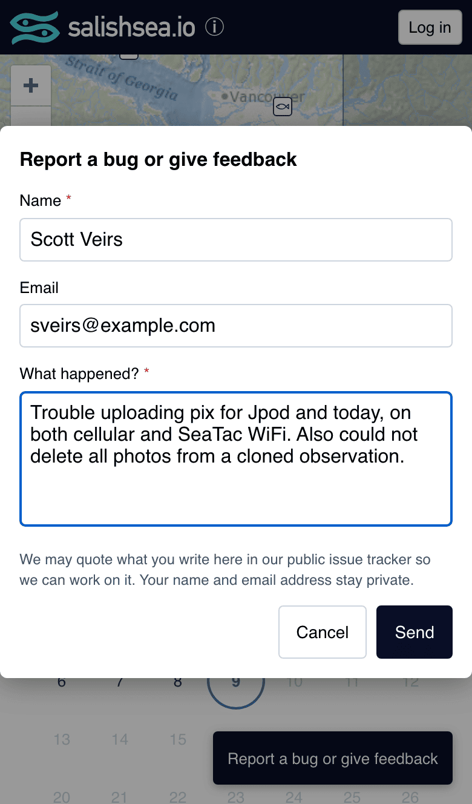
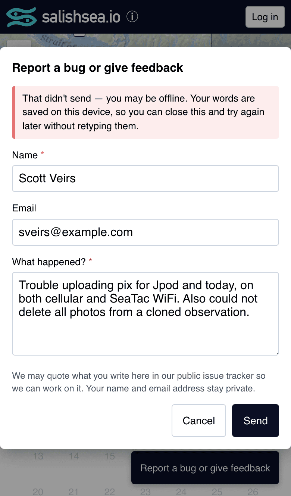

# 039 — Feedback goes to our own database, and the draft is never thrown away

**Status:** accepted · **Decided:** 2026-09-09 · bd `salish-5of`

## Context

On 2026-09-08 a contributor typed a paragraph into the feedback widget, pressed send, and got:

> Unable to send feedback. This could be because of network issues, or because you are using an ad-blocker.

He tried again a minute later. Same answer. The report named three real bugs — photos stranded mid-upload so a sighting could not be saved, a delete button that removed the wrong photo, and a failed upload that told nobody ([salish-8q9](https://github.com/salish-sea/salishsea-io/pull/435), `salish-jo5`, `salish-16b`) — and it reached us **only because he screenshotted the form before giving up**. He was, in his own words, testing the feedback button. It failed the test.

The widget was Sentry's `feedbackIntegration`, so a report only arrived if the person's browser could reach `sentry.io`. Two things make that a bad bet for this channel specifically. Sentry's ingest hosts appear on common tracker blocklists, so an ordinary iOS content blocker silences it — which fits a failure on cellular *and* airport WiFi, one flaky network being ruled out by the other. And the widget kept his text on screen while being unable to deliver it, offering nothing else to do with it.

The second half is the worse one. The whole value of a feedback channel is the words someone took the trouble to write, and ours discarded them at exactly the moment they mattered.

Sentry has zero events from that session, so we cannot say which cause it was. That is itself the finding: **we were relying on a third party to hear that we were broken, and had no way to tell when we could not.**

## Decision

**Feedback posts to our own Supabase.** [`public.feedback`](../../supabase/migrations/20260909180000_feedback.sql) plus a `submit_feedback` RPC, reached through the same client the map already uses. If the app works at all, feedback can be sent. Anyone may insert; nobody may read — there is no SELECT policy and no SELECT grant, because a report carries a name, an email and whatever the person chose to type.

The RLS check is on `user_uuid`, not `true`. `submit_feedback` stamps it from `auth.uid()`, but the INSERT grant also permits a direct insert, and with `WITH CHECK (true)` a signed-out client could post a row carrying someone else's uuid and have it read as "from a signed-in contributor". Requiring it to match the caller makes the stamp true however the row arrives.

**The draft is saved on every keystroke, not on submit.** Saving at submit protects nothing: by then the text has survived the risky part. What goes missing is a half-typed report when the tab closes, the browser reclaims the page, or the phone dies — and, in the case that prompted this, when the send fails. A failed send now keeps the draft, says so in as many words ("your words are saved on this device"), and leaves the form editable so a retry costs nothing.

**Sentry keeps the errors.** It is good at the failures nobody is watching, which is what [037](037-sentry-transmits-from-production-only.md) and [031](031-surfacing-failures.md) use it for. It is simply no longer how a *person* tells us something is wrong.

**A scheduled workflow files each report as a GitHub issue.** A table nobody opens is the same outcome as a widget that drops reports on the floor. [`feedback-notify.yml`](../../.github/workflows/feedback-notify.yml) claims rows where `notified_at IS NULL` and stamps each one as its issue is created, so a late or repeated run files nothing twice.

**The issue carries the message and not the reporter.** This repo is public. Name and email stay in the table, referenced by row id; the message itself is quoted **inside a fenced code block, never a blockquote**, because markdown renders inside blockquotes and a report containing `@someone` would notify a stranger while one containing an image would embed it. The fence is computed from the content so a message containing back-ticks cannot break out of it. The form says plainly that the message may be quoted in a public tracker and that contact details stay private.

The second is the one that matters, and the one the old widget got wrong: the send failed, and the report is still there.

## Rejected alternatives

**Keep Sentry's widget and add a fallback.** Least work, and it keeps a screenshot-triggering failure as the *normal* path with ours as the exception. Rejected because the fallback would be the untested path precisely when it was needed, and because two channels means two places for a report to be lost.

**Email us instead of filing an issue.** No public-repo privacy question at all, and no disclosure needed on the form. Rejected on dependencies: it needs an email provider, a secret, and a deliverability problem, to reach an inbox that is worse at triage than the tracker we already use for everything else.

**Publish nothing and have the issue be a pointer.** Safest, and it needs no note on the form. Rejected because triage would then require database access for every report, which makes acting on feedback harder than reading it — and the reports are the point.

**Keep a copy-to-clipboard escape on failure.** Considered and deferred. Worth revisiting if sends still fail once they no longer depend on a blockable host; until then it is UI for a case that should now be rare.

**Everything the client sent is fenced, not just the message.** `page_url`, `user_agent` and `release` are arguments to the same public RPC, so they are exactly as untrusted as the message is; rendered as markdown bullets, a crafted `user_agent` could mention people or embed an image just as well as a crafted message could.

**A flood becomes one issue, not hundreds.** The submit endpoint is open to anonymous callers by design — asking someone to sign in before they can say the site is broken defeats the point — so nothing stops a script filling the table. Above eight unnotified rows in a run the notifier files a single digest naming the row ids and quoting none of them, and stamps them all. That bounds an attack at one issue per run, and it is also the better outcome for an honest burst: when a bad deploy makes twenty people write in, one issue listing twenty reports is what you want to read. Nothing is discarded either way; every report is in the table in full.

**Each issue carries an invisible row marker**, and the notifier reads existing issues back before filing. The GitHub POST and the `notified_at` stamp are two operations, so a runner killed between them would otherwise leave a filed issue on an unstamped row and duplicate it on the next run. Listing by label rather than searching, because GitHub's search index lags by minutes — exactly the window this closes. Two notifiers running at once would defeat that check — both would list before either filed — so the script takes a Postgres session advisory lock, which covers a hand-run alongside a scheduled one and releases itself if the runner is killed.

## Consequences

A person who types their own email address *into the message* will see it published, since only the `email` column is withheld. The form's note is the disclosure; redacting address-shaped strings from the body was considered and left alone rather than guessing at what is safe to mangle.

The submit path is open to anonymous inserts, which is the point and also an abuse surface. Length limits are enforced by CHECK constraints and the notifier files at most eight individual issues, or one digest, per run — so a flood is bounded and visible rather than unbounded. There is no rate limiting; if it is ever needed, it belongs in front of the RPC.

Dropping `feedbackIntegration` takes its UI out of the Sentry bundle.

`__RELEASE__` is now defined in [`vite.config.js`](../../vite.config.js) from `GITHUB_SHA` or `git rev-parse`. Sentry's plugin already works a release out for its own events, but feedback must not depend on Sentry — that dependency is what this record removes.
