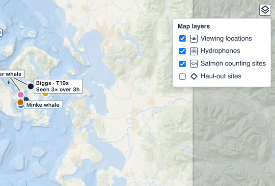
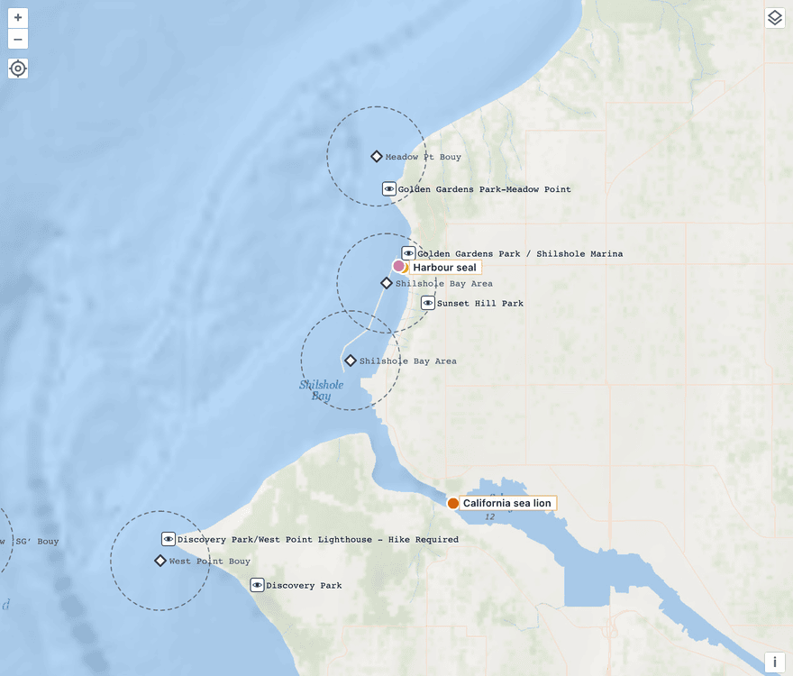

# 058 — The map's reference layers are switchable, haul-out sites among them, and their visibility is in the URL

**Status:** accepted · **Decided:** 2026-09-29 · **Context:** GitHub [#453](https://github.com/salish-sea/salishsea-io/issues/453), bd `salish-4v7` · **Extends:** [040](040-haul-out-sites-list-first.md) (which left the haul-out map layer to #453)

## Context

Four kinds of place are drawn on the map that nobody saw today: Orca Network's viewing locations, Orcasound's hydrophones, the salmon counting sites, and now the 362 haul-out sites of [040](040-haul-out-sites-list-first.md). The first three were fixed layers with no switch. Haul-out sites can't be one, because they line every shoreline. They answer an occasional question, "is this a known haul-out?", and the rest of the time they bury the sightings. #453 asked for a switch, and left three questions open: desktop only or mobile too, whether the layer reads the table the haul-out pages read, and whether visibility belongs in the URL.

BeeAtlas has the same control for its region layers: a button in the map's top-right corner that opens a menu, with the choice in the URL as `bm=` and absent while it is the default. That is the model here, with one difference. BeeAtlas's regions are clickable fills that tile the map, so only one can be shown at a time. These are points that coexist, so each one is a checkbox.

## Decision

**One control switches all four layers.** A button beside the zoom buttons opens a checkbox per layer. Each row shows the layer's own marker, so the menu is also the legend. The set of layers is spelled once, in [`src/reference-layers.ts`](../../src/reference-layers.ts), so adding one (the herring spawning grounds #453 also named) means adding a row there and a layer in `obs-map`.

**The defaults keep today's map.** Viewing locations, hydrophones and salmon counting sites stay on. Haul-out sites start off, and their data is fetched the first time someone switches them on, so a visit that never asks costs nothing.

**Desktop and mobile both.** It is an OpenLayers control, like the location button, so it follows the map wherever the mobile redesign ([#67](https://github.com/salish-sea/salishsea-io/issues/67)) puts it. Under a coarse pointer the rows get bigger touch targets.

**Visibility is in the URL as `l=`.** The value is the visible layers in a fixed order, separated by spaces, which a URL spells `+`: `l=viewpoints+hydrophones+salmon+haulouts`. A comma would come out as `%2C`. The parameter is absent while the set is the default, so ordinary links don't change, and `l=` with an empty value turns everything off. It lists the whole visible set rather than what differs from the default, so a link means the same thing if a default changes later. An unknown name is dropped and the rest of the link still works. A change replaces the history entry rather than pushing one, because showing a layer is a view setting and not a place to go Back to. Being in the URL is what lets a haul-out's page be a same-tab link: Back returns to the map with the layer still on.

**The haul-out layer reads `public.haulouts`, and each site links to its page.** As 040 intended, it reads the same rows the pages are built from, taking each site's id, name, point and radius. Production reads them from PostgREST. Under `VITE_READ_SOURCE=static` ([056](056-the-logged-out-read-path-is-built-as-static-files.md)), the `haulout-pages` build task writes them to `profiles/haulouts/sites.json`, beside the pages it already writes. That directory is already a declared output of the task, and the snapshot already holds the table, so the Stelis graph doesn't change.

**A site is drawn as a place, not a report.** It is a hollow slate diamond. A sighting is a filled circle in its taxon's colour, and seals and sea lions are the orange ones, so a site drawn in either would pass for a report. From zoom 12 each site also shows its name and a dashed ring at its radius. That is the circle a report must fall in to count for the site, drawn as the site's own page draws it. Sightings stay on top: a click on a sighting over a site selects the sighting.

## Rejected

- **One layer at a time, as BeeAtlas does.** Its regions are exclusive because they are clickable fills. These points don't conflict, and someone checking a seal report wants the viewing locations and the haul-outs together.
- **A permanent haul-out layer.** It would bury the sightings, which are the map's purpose.
- **Encoding only what differs from the default (`l=+haulouts`).** It is shorter, but a link's meaning would change whenever a default did.
- **Opening a site's page in a new tab,** as hydrophones and salmon sites open their external pages. The page is ours, and the URL now keeps the map's state, so the ordinary same-tab link is the right one.
- **A static GeoJSON asset, like the viewing locations.** 040 rejected this for the pages. The map should read the same list the pages do, and a hand-added site must reach both.

## Consequences

- The herring spawning grounds are not in this change. The prototype #453 mentions is not in any repository we hold, and a layer needs a data source whose licence has been checked against the [rights policy](../rights-policy.md) first. That work is tracked in bd.
- The haul-out layer's attribution names the WDFW atlas (Jeffries et al. 2000) in the map's attribution control while the layer is on.
